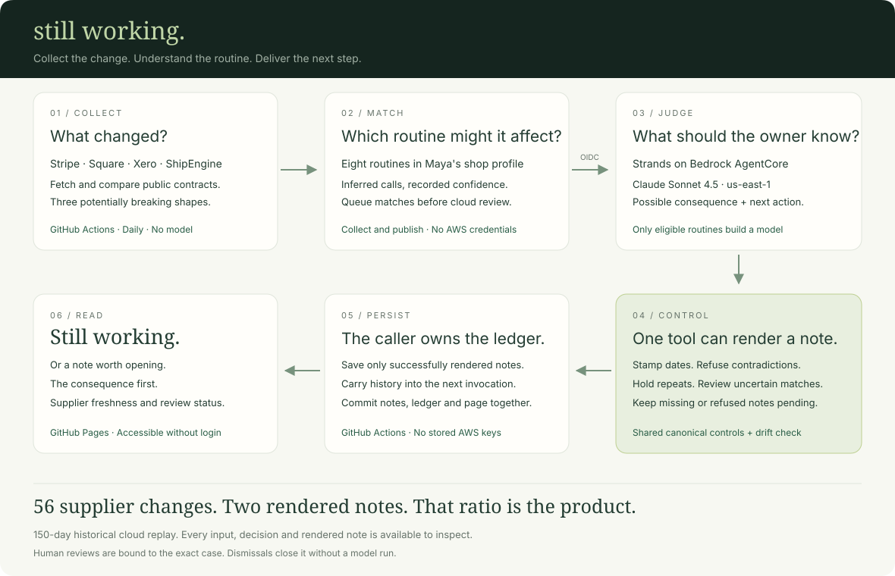

# Still Working: architecture

Maya is an illustrative shop owner. The system reads real supplier publications and proposes a consequence for her routines. It does not observe a running shop or confirm an outage.

## The daily path

1. GitHub Actions runs the deterministic checks and credential-free agent tests.
2. `tools/snapshot.py` fetches four public contracts and records structural changes.
3. `tools/deliver.py` matches new records and outstanding pending cases against the shop profile. Unrelated records need no cloud call.
4. A GitHub OIDC role, restricted to this repository's main branch, invokes the AgentCore runtime in `us-east-1`. The caller supplies the assessment and its persisted delivery ledger.
5. Runtime gates irrelevant, low-confidence and repeated routines before constructing a model. Eligible routines are judged independently using Strands and Bedrock (`global.anthropic.claude-sonnet-4-5-20250929-v1:0`).
6. The `send_to_maya` tool renders a note only after controls pass. The caller persists notes, pending cases and returned ledger in `contracts/`, then regenerates the static page and commits them together.
7. GitHub Pages serves `docs/`. Reading the page or the recorded replay needs no AWS account and invokes no model.

This is a single illustrative shop. The committed ledger and notes are suitable for the public demonstration, not a design for storing real customers' private business data.

## Controls around the delivery tool

`StampTheFacts` uses Strands `Transform` to replace routine identifiers, the publication date and relative age with values from the deterministic assessment. Medium-confidence notes receive an uncertainty statement even when the model omits one.

`OnlyWhenItCostsHer` applies `Deny` to irrelevant and repeated notes, `Proceed` to eligible confident mappings, and `Confirm` to low-confidence ones in the local agent. Live execution requires explicit approval; only scripted tests auto-answer. In AgentCore there is no interactive reviewer, so low confidence returns `held_for_a_person` without constructing a model.

The formatter rejects contradictory dates in prose. Refusal is a tool result the model can correct. The ledger updates only after a successful rendered tool result, not on an attempted call. If the model finishes without a usable note, the case remains pending. Runtime merges approved notes verbatim, so a second model cannot silently drop one.

Each invocation owns its date guard and state. The tests exercise concurrent requests with different dates, failed delivery followed by correction, repeats carried across invocations, and a new routine arriving alongside an already-known routine.

## Where memory lives

The local demonstration uses `AgentState` and `FileSessionManager`. The deployed runtime accepts `delivery_history` from its authenticated caller and returns the updated ledger. It does not pretend its process memory survives a restart.

The scheduled caller stores history, processed record hashes and pending records in `contracts/delivery-state.json`. Notes are published with that state. A failed cloud call aborts publication, so an unrendered message is not silently marked as delivered. Pending records are retried even on a morning with no new changes. Low-confidence mappings must be checked and corrected in the profile by a maintainer; the prototype has no completed human-review interface.

The repeat rule is five days for the same routine. It reduces duplicate notices but can also hide a distinct change to that routine. It is a chosen tradeoff, not a proven ideal interval.

## One source for deployed controls

`tools/sync_runtime.py` generates `runtime/app/StillWorking/sw_core/` from the canonical control definitions, memory and formatter in `agent/`. Its `--check` mode fails if they drift. The deployable imports only its own bundle and installed dependencies; `tools/check_runtime_isolation.py` checks tracked files to enforce that boundary.

No generated CDK resource definitions are hand-edited. [Runtime instructions](runtime/README.md) describe syncing, checking and deploying the existing runtime in place.

## Evidence a judge can inspect

[The browser replay](https://iamrobertmoore.github.io/still-working/replay/) presents 23 responses captured from the deployed runtime. Each record is replayed as of its historical date and the ledger is carried forward. The model produced two rendered notes. Quiet and repeated cases constructed no model.

The [recordings](docs/replay/recordings.json) contain the input, output, elapsed invocation time and source-file hashes. Timing includes runtime overhead and is not a model-performance benchmark. The replay is retrospective and uses an illustrative profile informed by the same history. Its notification ratio is not a precision or recall score.

## Optional Strands demonstrations

The local scripts also demonstrate `stream_async`, telemetry spans, structured setup output and `Agent.as_tool()` in a morning roundup. Those are development examples. The deployed daily path is the explicit pipeline above; it does not depend on the optional model-written roundup preserving every note.

## Failure boundaries

| Failure | Behaviour |
|---|---|
| Supplier unreachable | Fail the collection run; do not publish a fresh reassuring page |
| Missing AWS role or failed invocation | Fail delivery; do not commit a new delivery state |
| Unsupported mapping | Setup rejects invented calls; verification flags unsupported existing ones |
| Low-confidence mapping | Keep pending for a person |
| Model invents a date | Stamp known fields; reject contradictory prose |
| Model produces no usable note | Return a review state, not an all-clear |
| Supplier documentation lags deployment | Not detected |
| A previously flagged problem remains unresolved | A suppressed repeat does not mean it is fixed |

The daily page shows recent risks and pending reviews. Its quiet state means no new matched supplier risk was found, not that the shop's integrations were tested. The publication date of the oldest checked supplier is used for the page's check timestamp.
