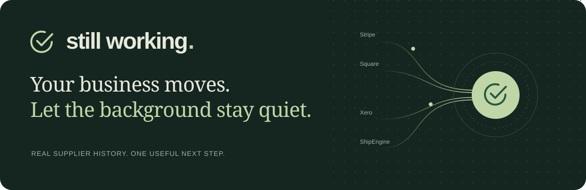

<p align="center"></p>

<p align="center"><strong>Supplier changes, translated into the one thing a shop owner needs to know.</strong></p>

<p align="center"><a href="https://iamrobertmoore.github.io/still-working/">Open the daily page</a> · <a href="https://iamrobertmoore.github.io/still-working/replay/">See what it catches</a> · <a href="https://iamrobertmoore.github.io/still-working/review/">Try a review decision</a></p>

Most mornings, Still Working has two words for you. When a supplier change deserves attention, it explains the business consequence and gives you something to do about it. The technical detail is already written for the developer who can help.

The demo follows Maya's twelve-person shop: card payments, payroll, stock between the counter and website, orders into the accounts, shipping labels. Four suppliers keep those routines moving. Still Working keeps an eye on what they change.

Built with **Strands Agents** and **Amazon Bedrock AgentCore** for **AWS Agents for Humans**, Professional Agents.

## A minute inside the product

| Try this | Watch what happens |
|---|---|
| [The stock warning](https://iamrobertmoore.github.io/still-working/replay/2026-07-14-square.html) | A Square change becomes a warning about selling stock twice, with a section ready to forward to Priya. |
| [The repeat held](https://iamrobertmoore.github.io/still-working/replay/2026-04-29-xero.html) | The payroll routine was flagged five days earlier. Its delivery ledger prevents another interruption before a model is built. |
| [Review a match](https://iamrobertmoore.github.io/still-working/review/) | Confirm the dependency, dismiss the case or stay unsure. Inspect the captured AWS result for each decision. |

Every historical decision is available in the [23-record cloud replay](https://iamrobertmoore.github.io/still-working/replay/). Open a note, follow its source, inspect its ledger. No AWS login required.

## That ratio is the product

I reconstructed five months of public supplier history and ran every recorded change through the deployed agent. The result is small enough to read in a coffee break.

<!-- measurement:start -->
**150 days. 23 supplier-change records across 22 calendar days. 56 individual changes. 9 potentially breaking changes.**

7 supplier-change records touched calls in Maya's shop profile.

**3 records contained a potentially breaking change to a mapped routine. The replay would interrupt her twice.**

| When | Who | What she would have been told | |
|---|---|---|---|
| 24 April | Your accounts | Paying the twelve of us | sent |
| 29 April | Your accounts | Paying the twelve of us | held, she was told 5 days earlier |
| 14 July | Your till and bookings | Stock moving between the counter and the website | sent |

Two interruptions in 5 months of replay, from 56 supplier changes. That is **3.6%**. **That ratio is the product.** [Method and scope](#evidence-and-scope).

_Window 2026-04-07 to 2026-09-04. Regenerated by the scheduled job on every run, never typed by hand. Re-run it with `python tools/impact.py --measure`._
<!-- measurement:end -->

## From small print to the next step


**Collect what changed.** The daily job compares the contracts published by Stripe, Square, Xero and ShipEngine. It recognises structural changes that can break an existing caller.

**Know which routine matters.** The shop profile connects supplier calls to eight routines, each with a business consequence and mapping confidence. Setup checks proposed calls against the published catalogue before saving them.

**Use judgement where it earns its place.** Strands runs on Bedrock AgentCore for eligible changes. The owner gets plain English; the developer gets the affected call and the check to make. Quiet and repeated cases never build a model.

**Keep control of delivery.** Interventions surround the only tool that can render a note. Code stamps known facts, holds repeats, and sends uncertain matches through case-specific human review. The caller persists successful notes and their ledger for the next run.

The [daily workflow](.github/workflows/contract-watch.yml) reaches AWS through temporary, repository-scoped OIDC access and publishes the notes, ledger and page together. Shared generated controls keep the local and deployed agent in sync. [Explore the architecture](ARCHITECTURE.md).

## A warning with somewhere to go

The owner gets the consequence first. The next action is explicit. Priya gets a separate technical handoff, ready to forward. This is the actual stock note captured from AgentCore:

<details>
<summary><strong>Read the recorded warning and developer handoff</strong></summary>

```
The website might keep selling after the counter sells the last one.

Your till and bookings removed a way to check inventory transfers on 14 July. If your stock routine relies on that check, it will have stopped updating when something sells at the counter.

When it happened: today, 14 July 2026
What it costs you: A refund, an apology, and a review. In December it is worse because the counter is busy and nobody is watching the numbers.
How late you would normally find out: A few days, when the second customer complains.

What to do: Forward this to Priya to check whether the routine uses the removed transfer check, and if it does, to rebuild it with what your till and bookings offers now.

--- forward this part to Priya ---
  Priya,
  FACT: Square removed endpoint GET /v2/inventory/transfers/{transfer_id} on 14 July 2026.
  INFERENCE: The stock-between-counter-and-website routine is mapped to this endpoint with high confidence. If the routine uses this call to verify or track inventory transfers between locations, it will have broken.
  Check whether the routine depends on GET /v2/inventory/transfers/{transfer_id}.
  If it does, find the current Square method for tracking inventory movement between the counter and website stock, and update the integration.
```

</details>

When a dependency needs checking, the [review flow](docs/REVIEW.md) turns the question into a decision. An imported approval applies to the exact supplier, date and routine. Dismissal closes the case without a model run. An unanswered question stays pending.

## The failures that made it better

- **The first profile returned zero.** Stock and payroll were missing. That exposed how much the result depends on setup, so I widened the profile and kept the evaluation history visible.
- **Three invented calls survived the other checks.** Comparing every mapping against supplier history exposed them. Setup now drops unsupported calls before saving a profile.
- **The model put the wrong date under FACT.** It did arithmetic on a date it had already been given. Code now stamps the known date and refuses contradictory dates in the prose.
- **The local controls outgrew the deployed copy.** I replaced handwritten copies with generated controls, added a drift check, and replayed every historical record against the actual runtime.

Each failure changed the implementation. The [tests](tests/) and [captured responses](docs/replay/recordings.json) make those changes inspectable.

## Suppliers

<!-- vendors:start -->
| What Maya calls it | Company | Calls published | Contract version |
|---|---|---|---|
| how customers pay me | Stripe | 594 | `2026-08-26.dahlia` |
| my till and my bookings | Square | 334 | `2.0` |
| my accounts, where my bookkeeper works | Xero Accounting | 235 | `19.0.0` |
| how I print labels | ShipEngine | 97 | `1.1.202604070904` |
<!-- vendors:end -->

Three of those stamp a version that moves. Square's remains `2.0` across meaningful changes, which is why I compare contract shape rather than rely on version strings.

## Run it

The local demonstration and tests need no AWS credentials:

```bash
python3 -m venv .venv
. .venv/bin/activate
pip install -r requirements.txt
pip install pytest bedrock-agentcore
python -m pytest tests/ -q
python tools/sync_runtime.py --check
python agent/still_working.py --demo
python tools/impact.py --measure
```

<details>
<summary>Collect current contracts or record your own cloud replay</summary>

```bash
python tools/backfill.py --since 2026-04-01
python tools/setup.py --verify
python tools/snapshot.py
```

With AWS credentials authorised to invoke your deployed runtime:

```bash
export STILL_WORKING_RUNTIME_ARN="<your AgentCore runtime ARN>"
python tools/replay.py
python tools/render_replay.py
```

Cloud invocation can incur AWS charges. Rendering the saved replay does not call AWS. Deployment instructions are in [runtime/README.md](runtime/README.md).

</details>

## Evidence and scope

The supplier publications and captured AWS execution are real. Maya, Priya and the shop are illustrative; their dependencies and business consequences are assumptions. The profile and five-day repeat rule were informed by the replay history. The ratio measures retrospective notification volume, not accuracy, prevented outages or savings. Customer testing and validation against a real integration remain the next evaluation step.

The detector reads published contracts, rather than deployed behaviour or shop traffic. It covers removed calls, removed parameters and optional parameters becoming required; other structural or behavioural changes and within-day reversions can be missed. Repeat suppression can hold a distinct issue in the same routine. Generated notes still need their inferences assessed.

Browser replays show saved responses, and delivery means a successfully rendered note. The separate review example uses deliberately lowered confidence and simulated reviewer decisions. Real reviews require operator import; the public page neither authenticates reviewers nor changes shared state. Private storage and reviewer authentication are the next product steps.

## Disclosure and licence

I previously built a CI job comparing a generated artifact with a live vendor API. No code from it is in this repository. That experience informed the choice to compare against third parties and distinguish a detected change from a failed job.

Built by [Robert Moore](https://github.com/iamrobertmoore). **MIT**. See [LICENSE](LICENSE). [Submission description](DEVPOST.md).
